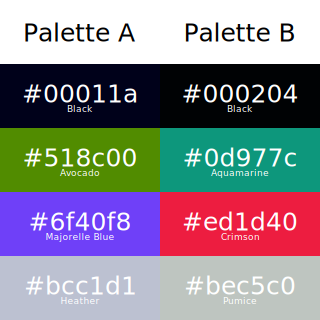

# [neomura/atmega328p-cartridge](../../readme.md)/[Documentation](../readme.md)/Capabilities

## Video

| Specification  | Value                                              |
| -------------- | -------------------------------------------------- |
| Video standard | NTSC or PAL 60.                                    |
| Resolution     | 156x113.                                           |
| Refresh rate   | 60Hz.                                              |
| Colors         | 6, selecting 1 of 2 palettes of 4 colors per line. |

### Palette

Colors as captured from a prototype unit running into a CSL USB 2.0 Audio/Video Grabber and will likely differ.

## Audio

| Specification | Value                |
| ------------- | -------------------- |
| Channels      | 2                    |
| Bit depth     | 8                    |
| Sample Rate   | 15,699.72587719298Hz |

## Pads

Up to 4 pads are simultaneously supported.
