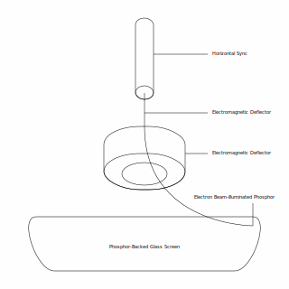

# [neomura/atmega328p-cartridge](../../readme.md)/[Documentation](../readme.md)/Composite Video

Composite video is that which flows over the yellow cable of the yellow-white-and-red RCA cables often seen on games consoles between 1990 and 2010.

While it is a video protocol, the way in which it works is tightly bound to how a classic CRT (boxy) TV works, which must also be understood to appreciate why composite video is specified how it is.

A CRT TV has a glass screen which displays a picture.  Behind it is an electron gun.  When energized, this fires a laser-like beam of electrons at the back of the glass, which illuminates a spot of the phosphor on the rear side of the glass.  The electron gun's output can be be controlled electronically to change the brightness of this spot.  Electromagentic coils can then deflect this beam of electrons between the gun and the glass, which allows the spot to be moved around the screen electronically.

Early arcade games directly interfaced the game with these electromagnetic coils, such as Atari's Battlezone, Star Wars and Tempest, allowing for crisp line drawings to be shown.  Composite video does not grant this level of control; instead, the beam scans from the top of the screen to the bottom, zig-zagging from left to right and back on the way down.

To start a frame (pull the gun to the top of the screen), a VSYNC (vertical synchronization) signal is sent.  This is a pulse wave alternating between 0 and -40 IRE (1 IRE = 1/140V).

| Statistic     |     |    |     |    |     |    |     |    |     |    |     |    |     |   |     |   |     |   |     |   |     |   |     |    |     |    |     |    |     |    |     |    |
| ------------- | --- | -- | --- | -- | --- | -- | --- | -- | --- | -- | --- | -- | --- | - | --- | - | --- | - | --- | - | --- | - | --- | -- | --- | -- | --- | -- | --- | -- | --- | -- |
| Duration (µs) | 2   | 30 | 2   | 30 | 2   | 30 | 2   | 30 | 2   | 30 | 2   | 30 | 30  | 2 | 30  | 2 | 30  | 2 | 30  | 2 | 30  | 2 | 2   | 30 | 2   | 30 | 2   | 30 | 2   | 30 | 2   | 30 |
| Level (IRE)   | -40 | 0  | -40 | 0  | -40 | 0  | -40 | 0  | -40 | 0  | -40 | 0  | -40 | 0 | -40 | 0 | -40 | 0 | -40 | 0 | -40 | 0 | -40 | 0  | -40 | 0  | -40 | 0  | -40 | 0  | -40 | 0  |

The middle section which spends more time at -40IRE than 0IRE is the VSYNC signal itself; the preceding and following signals are known as equalization pulses and exist to assist the electronics in older TVs.

After this signal, a repeating pattern is sent:

First is a 4.7µs -40IRE HSYNC (horizontal synchronization) pulse.  This instructs the TV to return the gun to the left of the screen.  There is a short "porch" in which 0IRE is sent, and then, the active video region.

The active region is an analog segment in which voltages between 7.5IRE and 100IRE map to the full luminance range available; 7.5IRE represents black, and 100IRE represents white.  Given the above signal, you could expect to see:

After the active region, there is another, shorter porch of 0IRE.

These timings break down as:

| Duration (µs) | Description   |
| ------------- | ------------- |
| 4.7           | HSYNC pulse.  |
| 4.7           | Porch.        |
| 52.6          | Active video. |
| 1.5           | Porch.        |

Totalling 63.5µs.

This will repeat until the next VSYNC signal.  This VSYNC signal, however, will be somewhat different:

| Statistic     |     |    |     |    |     |    |     |    |     |    |     |   |     |   |     |   |     |   |     |   |     |    |     |    |     |    |     |    |
| ------------- | --- | -- | --- | -- | --- | -- | --- | -- | --- | -- | --- | - | --- | - | --- | - | --- | - | --- | - | --- | -- | --- | -- | --- | -- | --- | -- |
| Duration (µs) | 2   | 30 | 2   | 30 | 2   | 30 | 2   | 30 | 2   | 30 | 30  | 2 | 30  | 2 | 30  | 2 | 30  | 2 | 30  | 2 | 2   | 30 | 2   | 30 | 2   | 30 | 2   | 30 |
| Level (IRE)   | -40 | 0  | -40 | 0  | -40 | 0  | -40 | 0  | -40 | 0  | -40 | 0 | -40 | 0 | -40 | 0 | -40 | 0 | -40 | 0 | -40 | 0  | -40 | 0  | -40 | 0  | -40 | 0  |

The reason for this is that composite video is interlaced; as early TV signals had limited bandwidth, only 30FPS worth of pixel data was possible.  However, if the screen was scanned at only 30Hz, a noticeable flicker would be present.  To work around this, each screen is actually scanned twice per frame (60Hz; usually matching the local mains frequency to prevent rolling brightness pulses due to the interference pattern between poorly regulated power supply and refresh rate), each time only illuminating alternating rows (so that when both fields of the frame are overlaid, a complete picture is drawn).  The two types of VSYNC signal distinguish between the "odd" and "even" fields.

A total of 525 lines is composed as follows:

| Lines    | Description                         |
| -------- | ----------------------------------- |
| 8        | Vertical sync (odd).                |
| 15       | Blank lines (just horizontal sync). |
| 240      | Active lines (odd).                 |
| 6.5      | Vertical sync (even).               |
| 15.5     | Blank lines (just horizontal sync). |
| 240      | Active lines (even).                |

As specified, composite video has (frame) resolution of 640x480.  However, timings varied greatly on early transmitters and TVs, so content near the edges of this visible area were sometimes cropped.  Broadcasters have (unfortunately bespoke) internal standards defining what they consider to be the "title safe area" (text, etc. usually 80% of the display) and the "action safe area" (usually 90% of the display).

## References

| Link                                                                                                                                                                                                                           | Description                                |
| ------------------------------------------------------------------------------------------------------------------------------------------------------------------------------------------------------------------------------ | ------------------------------------------ |
| [https://www.maximintegrated.com/en/design/technical-documents/tutorials/7/734.html#Composite/CVBS%20Interface](https://www.maximintegrated.com/en/design/technical-documents/tutorials/7/734.html#Composite/CVBS%20Interface) | Details on how NTSC composite video works. |
| [https://videocide.com/glossary/vertical-sync/](https://videocide.com/glossary/vertical-sync/)                                                                                                                                 | Details on vertical sync timing.           |
