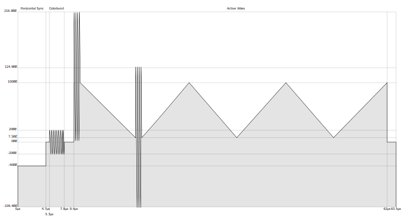

# [neomura/atmega328p-cartridge](../../readme.md)/[Documentation](../readme.md)/NTSC

NTSC is one of the competing standards which adds full color to the original grayscale TV signal specification.  It was common in North America (with a NTSC-J Japanese variant).  Most TVs around the world from the mid-1980s onwards support NTSC natively, even if they are sold as PAL sets.

Color and grayscale TVs and signals had to remain fully compatible, so a 3.579545MHz color indicating sine wave was added into the existing grayscale signal:

Existing grayscale TV sets would eliminate this in their input low-pass filters, and thus, would be able to display color TV signals in grayscale.

First, a "colorburst" consisting of 9 cycles of sine with a peak-to-peak amplitude of 40IRE was added during the porch following the HSYNC pulse.  Its position can vary within the porch, but it must have matching phase between lines.  This serves two purposes: it clearly identifies a color TV signal, and sets a "reference phase" which will be used later on.

The active video segment, as before, is an analog voltage specifying luminance.  However, the color wave is added on top.

Its amplitude (with a maximum of 433.8IRE peak-to-peak) specifies the saturation of the color.  For grayscale broadcasts, this would, of course, be zero - meaning that color TV sets would correctly display an unsaturated picture.

Its phase is compared to that of the colorburst to select the hue:

| Phase difference | Hue    |
| ---------------- | ------ |
| 0°               | Yellow |
| 45°              | Orange |
| 90°              | Red    |
| 180°             | Purple |
| 225°             | Blue   |
| 270°             | Cyan   |
| 315°             | Green  |

## References

| Link                                                                                                                                                                                                                           | Description                                   |
| ------------------------------------------------------------------------------------------------------------------------------------------------------------------------------------------------------------------------------ | --------------------------------------------- |
| [https://www.maximintegrated.com/en/design/technical-documents/tutorials/7/734.html#Composite/CVBS%20Interface](https://www.maximintegrated.com/en/design/technical-documents/tutorials/7/734.html#Composite/CVBS%20Interface) | Details on how NTSC composite video works.    |
| [https://cnyack.homestead.com/files/modulation/ntsc_sig.htm](https://cnyack.homestead.com/files/modulation/ntsc_sig.htm)                                                                                                       | Details on hue/phase in NTSC composite video. |
