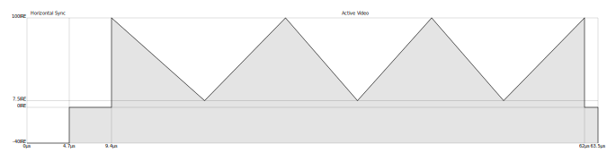
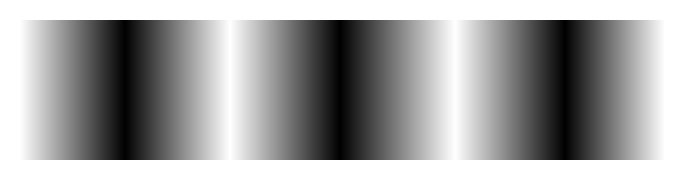
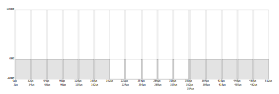
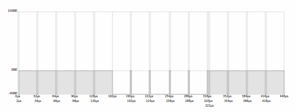

# [neomura/atmega328p-cartridge](../readme.md)/Documentation

This project is derived from the [Arduinocade project](https://github.com/rossumur/Arduinocade), but makes significant changes.

Firstly, the clock speed is halved from 28.6363MHz to 14.31818MHz - this means that the CPU is not overclocked - compatibility and stability should improve (allowing for the use of ATMega644P, ATMega1284P and ATMega2560 with circuit design changes for expanded storage and memory).

As a consequence of this, the video system is reduced from 16 to 4 colors per scanline.  This is a significant step down in picture quality, but halves the amount of space required to store sprites or tiles.  It also halves the number of clock cycles spent reading from to writing to SRAM or flash storage per pixel.

Horizontal resolution has been reduced from 160 to 128 pixels (reducing it to the title-safe area).

The vertical resolution has also been halved, from 192 to 96; each generated scanline is output twice.  This was done for the following reasons:

- It doubles the amount of time available to generate the next scanline, to help compensate for the halved clock speed.
- It makes pixels square (Arduinocade uses 2:1 rectangular pixels).
- It halves the amount of space required to store sprites or tiles again.

Infrared controller support has been replaced with Neomura-compatible SNES-style controller support.

Finally, the engine is written in AVR assembler rather than C; this means that tooling upgrades should not break its timing.

## Video

Most of the ATMega328P's CPU time is spent generating video; the approach taken influences every other aspect of this cartridge design, so must be understood before the rest of the system.

The video output is compatible NTSC composite video; the yellow cable of the red/white/yellow, targeting American TVs.

### NTSC composite video signal

A CRT TV has red, green and blue electron guns which illuminate the panel from behind.  Their brightness can be adjusted individually, and their target on the panel moved as one, at a very high speed.

Once per field (60 times per second), the electron guns scan from the top of the panel to the bottom, then back up to the top.  On the way down, they zig-zag from left to right and back (scanlines).

Brightnesses of the red, green and blue electron guns are controlled in sync with this motion to draw a picture, when travelling from left to right.  They are turned off when returning to the left from the right, or when returning to the top from the bottom.  This is known as horizontal and vertical blanking respectively.  The rectangle in which the electron guns are switched on is known as the active area.

#### Black-and-white

Black-and-white composite video matches up with this process near exactly.  Once per active scanline, a signal similar to the following is produced:

The signal is pulled low to indicate the start of a scanline (known as the horizontal sync).  After a short delay, the voltage directly controls the brightness of the electron guns as they scan from left to right; the range from 7.5 to 100 IRE is expected.  The active area is 640 pixels wide.

Voltages are measured in IREs, which are equivalent to 1/140th of a volt.

The resulting scanline should look similar to the following:

##### Vertical sync

The TV also needs to know when a frame starts and ends.  This is done by sending a sequence of pulses alternating between -40 IRE and 100 IRE.

Most TV signals are "interlaced", where half (243 scanlines) of the picture (486 scanlines) is sent each field, skipping every second line.  The vertical sync lines indicate whether this field is for the odd or even scanlines of the final frame produced by each pair of fields.

When odd:

| Level    | Duration |
| -------- | -------- |
| -140 IRE | 2µs      |
| 0 IRE    | 30µs     |
| -140 IRE | 2µs      |
| 0 IRE    | 30µs     |
| -140 IRE | 2µs      |
| 0 IRE    | 30µs     |
| -140 IRE | 2µs      |
| 0 IRE    | 30µs     |
| -140 IRE | 2µs      |
| 0 IRE    | 30µs     |
| -140 IRE | 2µs      |
| 0 IRE    | 30µs     |
| -140 IRE | 30µs     |
| 0 IRE    | 2µs      |
| -140 IRE | 30µs     |
| 0 IRE    | 2µs      |
| -140 IRE | 30µs     |
| 0 IRE    | 2µs      |
| -140 IRE | 30µs     |
| 0 IRE    | 2µs      |
| -140 IRE | 30µs     |
| 0 IRE    | 2µs      |
| -140 IRE | 2µs      |
| 0 IRE    | 30µs     |
| -140 IRE | 2µs      |
| 0 IRE    | 30µs     |
| -140 IRE | 2µs      |
| 0 IRE    | 30µs     |
| -140 IRE | 2µs      |
| 0 IRE    | 30µs     |
| -140 IRE | 2µs      |
| 0 IRE    | 30µs     |

When even:

| Level    | Duration |
| -------- | -------- |
| -140 IRE | 2µs      |
| 0 IRE    | 30µs     |
| -140 IRE | 2µs      |
| 0 IRE    | 30µs     |
| -140 IRE | 2µs      |
| 0 IRE    | 30µs     |
| -140 IRE | 2µs      |
| 0 IRE    | 30µs     |
| -140 IRE | 2µs      |
| 0 IRE    | 30µs     |
| -140 IRE | 30µs     |
| 0 IRE    | 2µs      |
| -140 IRE | 30µs     |
| 0 IRE    | 2µs      |
| -140 IRE | 30µs     |
| 0 IRE    | 2µs      |
| -140 IRE | 30µs     |
| 0 IRE    | 2µs      |
| -140 IRE | 30µs     |
| 0 IRE    | 2µs      |
| -140 IRE | 2µs      |
| 0 IRE    | 30µs     |
| -140 IRE | 2µs      |
| 0 IRE    | 30µs     |
| -140 IRE | 2µs      |
| 0 IRE    | 30µs     |
| -140 IRE | 2µs      |
| 0 IRE    | 30µs     |

When put together with the active video lines and the blank lines between, one full frame of NTSC video should be:

| Lines    | Description                         |
| -------- | ----------------------------------- |
| 8        | Vertical sync (odd).                |
| 15       | Blank lines (just horizontal sync). |
| 240      | Active lines (odd).                 |
| 6.5      | Vertical sync (even).               |
| 15.5     | Blank lines (just horizontal sync). |
| 240      | Active lines (even).                |

This totals 525 lines.

##### Safe areas

Most TVs do not show the full active area, trimming columns and rows from the edges.  An area in which this is understood to not occur is known as a safe area, though there are no standards regarding this.

Most organizations define multiple safe areas for their content or systems:

| Name             | Description                                          | Typical scale | Width | Height |
| ---------------- | ---------------------------------------------------- | ------------- | ----- | ------ |
| Action safe area | Non-critical content, such as backgrounds.           | 90%           | 576   | 432    |
| Title safe area  | Critical content, such as text or gameplay elements. | 80%           | 512   | 384    |

#### Color

Color was added after the black-and-white standard was in widespread use.  It was implemented in such a manner that all of the following would work:

| Signal          | TV              | Result          |
| --------------- | --------------- | --------------- |
| Black-and-white | Black-and-white | Black-and-white |
| Black-and-white | Color           | Black-and-white |
| Color           | Black-and-white | Black-and-white |
| Color           | Color           | Color           |

A color signal is very similar to a black-and-white signal, with a number of exceptions:

9 cycles of 3.579545MHz sine wave with an amplitude of 20 IRE are present between the horizontal sync and active video.  This is known as the "colorburst".  Its purpose is to define a "reference phase" (which will be used later on).

The active video segment includes another 3.579545MHz sine wave of varying amplitude and phase summed to the black-and-white standard's luminance voltage.  Its amplitude defines the saturation of the color.  If there is no sine wave, this is an absence of saturation, creating a greyscale value (hence backwards compatible with black-and-white signals which did not include a sine wave).  The maximum amplitude of 116.9 IRE specifies the most saturated color posible.

To select a hue, the phase of the colorburst and the sine wave in the active video section are compared:

| Phase difference | Hue    |
| ---------------- | ------ |
| 0°               | Yellow |
| 45°              | Orange |
| 90°              | Red    |
| 180°             | Purple |
| 225°             | Blue   |
| 270°             | Cyan   |
| 315°             | Green  |

### Generation by the ATMega328P

The ATMega328P has three internal hardware timers (OC0/1/2).  These can be configured to continuously count CPU cycles and raise interrupts or control GPIO in response to them reaching specific values.

Only OC1 is capable of counting beyond an 8-bit number, so it is used to generate the horizontal sync pulse.  It is configured without a clock divider ("prescaler") with a "top" value of 907 cycles (63.5µs per line, at 14.31818MHz) in "fast PWM" mode (count straight up from 0 in a sawtooth pattern, rather than "phase correct" mode, where it counts up from 0, then back down to 0).

Each timer has two channels (OC*A/B), which have a comparison mode, a value to compare to, and both an interrupt and GPIO pin which they can control.

OC1A is configured in "compare match" mode with a comparison value of 134, with the associated GPIO pin (PB1/digital pin 9) configured as an output.  This means that it is pulled to 0V until approximately 4.7µs into the scanline, at which point it is pulled to 5V until the timer resets at the end of the line.

OC1B is configured with a comparison value of 100, which is slighly earlier than the end of the horizontal sync.  This is configured to trigger an interrupt in which the rest of the video signal is generated.

AVR interrupts have a small amount of timing jitter, so a loop at the start of the interrupt handler busy-waits to compensate.

Both the color burst and the active video segment are generated using the AVR's serial port (SPI).  This is configured with the minimum clock divider possible (2x) in Master SPI mode with an 8-bit character size.

This effectively means that any byte written to the UDR0 register will be automatically written to TXD (PD1/digital pin 1) at a rate of one bit every two cycles, where bits which are set pull the pin to 5V, and bits which are cleared pull the pin to 0V.  This happens in the background, leaving the CPU free for the 15 cycles until the next byte is due.

Colorburst is generated by passing two bytes of 01010101 to UDR0, producing 9 pulses at the required frequency of 3.579545MHz when the start bit is taken into account; this is sufficient in that there is a fundamental harmonic at the correct frequency, and receiving TVs will ignore the rest of the series.

For the active video area, each byte written to the UDR0 register represents four two-bit color values, spanning eight NTSC pixels.  The harmonic series generated by the sudden increases and decreases in voltage is interpreted by the TV as being a sine wave to be compared to the colorburst by phase.

| Color | Palette A                  | Palette B                  |
| ----- | -------------------------- | -------------------------- |
| 0     | #0f0f0f (NTSC black)       | #0f0f0f (NTSC black)       |
| 1     | #c2c500 (lime)             | #17fb6b (spring green)     |
| 2     | #8481ff (light slate blue) | #ff4fdd (fuchsia)          |
| 3     | #f0f0f0 (NTSC white)       | #0f0f0f (NTSC black)       |

The 15 cycles available are insufficient to evaluate the color of the pixel so the interrupt copies this data near-directly from one of a pair of buffers in SRAM.

During the active video lines, the game's main loop is spent filling the buffer that the interrupt is not currently reading from, then busy-waiting until the buffers are swapped.

Per pair of scanlines, approximately 392 cycles are available to populate the buffer.  Assuming 64 cycles to clear the buffer, this leaves 328 to draw sprites.  In a best-case scenario (3 cycles to read a byte from flash, 2 cycles to overwrite) this allows 262 pixels to be blitted from flash.  In reality, logic will be required to modify sprite data to account

The colorburst can be delayed a single clock cycle to switch between the two available palettes for that line, effectively adding a single-cycle phase shift to the following active video segment (which can only select phases with a precision of 2 cycles due to the SPI hardware's minimum divider of 2x).

#### External components

The two pins used to generate video form a resistor divider, the output of which is the system's composite output:

| Pin                   | Resistor |
| --------------------- | -------- |
| PB1/digital pin 9     | 1K       |
| TXD/PD1/digital pin 1 | 100R     |

When the 75R input impedence of the receiving system is taken into account, this can produce the following voltages:

| PB1/digital pin 9 | TXD/PD1/digital pin 1 | Voltage   | IRE       | Offset IRE |
| ----------------- | --------------------- | --------- | --------- | ---------- |
| 0V                | 0V                    | 0V        | 0         | -42        |
| 5V                | 0V                    | 0.303748V | 42.52472  | 0.52472    |
| 0V                | 5V                    | 0.646273V | 90.47822  | 48.47822   |
| 5V                | 5V                    | 0.950022V | 133.00308 | 91.00308   |

This produces values offset by approximately 40 IRE.  This will, however, still work.

## References

| Link                                                                                                                                                                                                               | Description                                      |
| ------------------------------------------------------------------------------------------------------------------------------------------------------------------------------------------------------------------ | ------------------------------------------------ |
| [https://github.com/rossumur/Arduinocade](https://github.com/rossumur/Arduinocade)                                                                                                                                 | Arduinocade project from which this was derived. |
| [https://cnyack.homestead.com/files/modulation/ntsc_sig.htm](https://cnyack.homestead.com/files/modulation/ntsc_sig.htm)                                                                                           | Color phase details.                             |
| [https://videocide.com/glossary/vertical-sync/](https://videocide.com/glossary/vertical-sync/)                                                                                                                     | Timing details on the vertical sync lines.       |
| [https://en.wikipedia.org/wiki/IRE_(unit)]/(https://en.wikipedia.org/wiki/IRE_(unit))                                                                                                                              | Details on IRE units.                            |
| [https://www.youtube.com/watch?v=yhUCM9N-OKc&feature=emb_title](https://www.youtube.com/watch?v=yhUCM9N-OKc&feature=emb_title)                                                                                     | Another approach to AVR video generation.        |
| [http://www.hpcc.ecs.soton.ac.uk/dan/pic/video_PIC.htm](http://www.hpcc.ecs.soton.ac.uk/dan/pic/video_PIC.htm)                                                                                                     | Similar approach with PIC.                       |
| [https://extremereach.com/blog/understanding-the-safe-title-area-in-tv-production-and-why-its-important/](https://extremereach.com/blog/understanding-the-safe-title-area-in-tv-production-and-why-its-important/) | Details on safe areas.                           |

A project was found while researching which used a PIC's serial output to generate color NTSC video through artifacting, through which the Arduinocade project was found.  This appears to have been lost.
